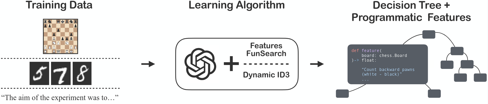
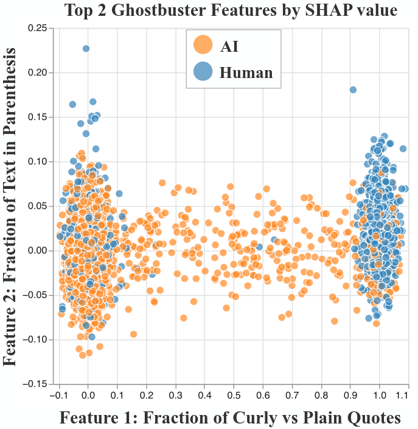

# LeaPR: Learned Programmatic Representation models

This repository contains the implementation corresponding to the following paper:

Programmatic Representation Learning with Language Models

(arXiv link coming soon)

LeaPR models are neural network-free machine learning models: they combine *feature functions* represented as (LLM-synthesized) Python functions with *decision tree* predictors learned on top of those features. These models can be trained for any supervised learning task.



LeaPR models can contain hundreds or thousands of automatically generated features, modularly combined by decision trees. Because features are LLM-generated code, they tend to be highly readable and interpretable, and tools such as SHAP values, used to interpret and explain decisions from classical ML models, can be easily applied to LeaPR models.

Here is an example of a feature learned for the *text classification* task of classifying human vs ChatGPT-generated text (which we evaluated using the [Ghostbuster dataset](https://github.com/vivek3141/ghostbuster-data/) from NAACL 2024):

```python
def feature(text: str) -> float:
    'Fraction of quotation marks that are curly/typographic quotes (e.g., \u2018 \u2019 \u201c \u201d) vs plain ASCII quotes, indicating published/edited text'
    import re
    if not text:
        return 0.0
    # count curly quote characters and total quote-like characters
    curly = sum(text.count(ch) for ch in ('\u2018','\u2019','\u201a','\u201c','\u201d','\u201e'))
    plain = sum(text.count(ch) for ch in (\"'\", '\"'))
    total = curly + plain
    if total == 0:
        return 0.0
    return float(curly) / total
```

This feature was generated by gpt-5-mini. It turns out that, for human-generated text, this feature is either at 0 (meaning all quotes, if there are any, are "curly" quotes) or at 1 (meaning the text contains only plain ASCII quotes). However, many ChatGPT-generated essays are in the middle, with the model mixing up both kinds of characters in the same essay. On Ghostbuster, LeaPR essentially matches the state-of-the-art (neural) models except that the final model only relies on a large collection of simple features like the one above. Check out the paper for more details on these results.



Here, each data point is a text sample from the Ghostbuster dataset, either written by a human or by ChatGPT, and each axis corresponds to the value of one of the top-2 most influential features by SHAP value (small Gaussian jitter to aid visualization). The quote-related feature described above is the top-1 by SHAP value in our best learned model on this dataset. The second one is the fraction of text inside parenthesis. As the image shows, a large fraction of text in parenthesis generally indicates ChatGPT-generated text in the dataset. The idea of LeaPR, of course, is that we did not have to think of such features by ourselves, nor the hundreds of others that, together, nearly saturate performance in the dataset just with a random forest. Yet, we can readily understand them.

## Setup

Use `requirements.txt` to start a virtual environment and install dependencies:

```sh
[leapr/] $ python -m venv venv
[leapr/] $ source venv/bin/activate
[leapr/] (venv) $ pip install -r requirements.txt
...
```

All LLM calls use provider APIs, and you should have your API keys in the appropriate environment variables. Currently, the implementation only supports OpenAI and Anthropic models, but we use langchain to run models, so it should be very easy to add other providers. If you want to run with other models, install the appropriate langchain vendor package and add a case for your new provider in `llm_generator.py`.

### Datasets

For **chess**, you can download the data we use from Lichess using the `download.py` script we provide. Note that the full datasets are large (80+ GB), even though we don't load them fully.

```sh
[leapr/] $ python download.py all
```

This will also download the Stockfish engine, which will be used to calculate the ground-truth moves in the move accuracy evaluation.

For **image classification**, the datasets are downloaded when needed using huggingface, so you don't need to do anything.

For **text classification**, you can download Ghostbuster with:

``` sh
[leapr/] (venv) $ cd data
[leapr/data/] (venv) $ git clone https://github.com/vivek3141/ghostbuster-data/
...
[leapr/data/] (venv) $ cd ..
[leapr/] (venv) $ python create_ghostbuster_datasets.py
```

You can also use this [AI vs Human Text](https://www.kaggle.com/datasets/shanegerami/ai-vs-human-text/data) Kaggle competition dataset (not used in the paper, but LeaPR also quickly saturates validation performance here). Download and extract `AI_Human.csv` and place it at `data/AI_Human.csv`

## Running LeaPR

The main LeaPR algorithms are implemented in `representation/did3.py` and `representation/f2.py`. We use Hydra for configuration, so all experiments read from files in `config/`.

To run the experiment pipeline in the paper, the easiest way is to either use or refer to the `Makefile`. It has targets specifically for each of the following steps:

1. Running the representation learning algorithms (did3 and f2). These are the `results/features/%.json` targets. The Makefile itself simply runs `launch.py` for this, which has a simple interface to run LeaPR models:

``` sh
[leapr/] (venv) $ python launch.py --leapr --learner $(method) --domain $(domain_dataset) --model $(model)
```

This will result in a simple JSON file containing only the set of learned **features**. You can look at existing files in the `results/features/` directory, as well as features resulting from our experiments.

2. Training random forests using the features learned in the previous step, and evaluating them on the task they were trained for (e.g., classification or regression). These are the `results/evals/%.json` targets in the Makefile, and simply trigger `launch.py` with different arguments:

``` sh
[leapr/] (venv) $ python launch.py --train --learner $(method) --domain $(domain_dataset) --model $(model)
```

`launch.py` will assume that the features for that combination of method/dataset/model have already been generated (this will not call LLMs - it's a purely offline step, so the LLM name here is only used to know what feature file to look for).

3. (Chess-specific) Evaluate a given learned board evaluation function on the task of predicting the next move in a game. These are the `results/evals/chess/%.json` targets. This will call the `evaluation.py` script pointing to an already trained (Transformer or random forest) model.

## Looking at existing learned features

See the `results/features/` directory for features learned in the experiments in the paper. There are some features learned with Claude 4 Sonnet that we did not complete in time to include in the paper, but they are interesting as well and generally perform competitively (though some are overly ambitious and sometimes slow to run in chess).

## Running in other custom domains

More instructions here soon. Feel free to open a Github issue if you're interested in this but this hasn't been written yet.
